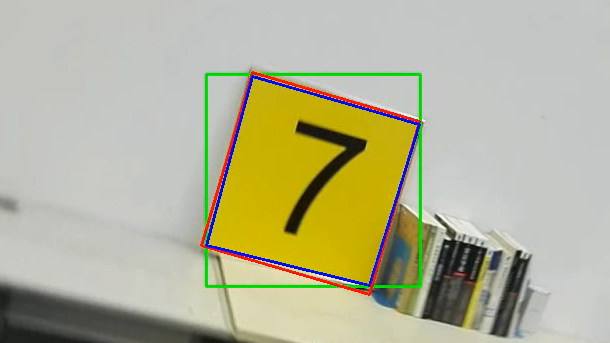
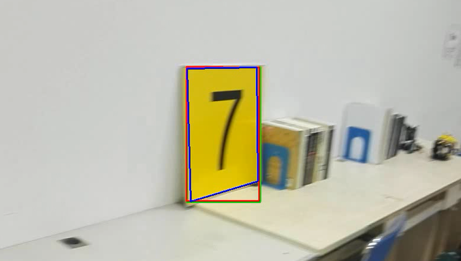

# 程序笔记

- [程序笔记](#程序笔记)
    - [square_detection](#square_detection)

## square_detection
*任务要求：给定两个视频，视频中有一个黄色的矩形面板，要求将其框出来，并输出结果*

整体思路就是使用HSV模型利用颜色的不同将目标物体的与周围环境区分开（适用于目标颜色与周围环境颜色差距较大时），然后再将其二值化后将目标物体框出。

主要的过程方法在程序[square_detection.py](https://github.com/XinzheTing/Courses/blob/master/DigitalImageProcessing/square_detection/square_detection.py)中注释已经写的很清楚了，这里主要说一下在框出目标物体时所使用的三种方法（这三种方法在处理data1.avi时效果相同，主要区别是在处理data2.avi时，因为data2.avi考虑了目标物体的旋转和倾斜）：

1. 固定矩形（我暂且这么称呼它）
    在这种方法中，我使用了boundingRect函数，它的作用是计算轮廓的垂直边界最小矩形，**矩形是与图像上下边界平行的**。这个函数返回来矩形左上角顶点坐标和举行的长和宽，依据这些信息我们就可以画出一个矩形。但是这种方法没有考虑旋转，在目标与图像上下边界平行时没有问题，但是当目标发生了旋转，这时框出的矩形包含了很多除目标物体以外的区域，如下图绿色矩形

    

    

    

2. 外接矩形
   这种方法使用minAreaRect函数，它是计算轮廓的外接矩形，弥补了固定矩形方法中在目标物体发生旋转时的不足。见上图红色矩形。

3. 近似轮廓
   以上两种方法在目标物体发生倾斜时，仍有一些不足。进一步学习了解到，findContours所找到的轮廓直接输出的话最贴近目标物体的形状，不论物体如何变化（远近，旋转，倾斜）都可以很好的描绘出，但是findContours所找到的轮廓是一些列散列的点。使用轮廓近似函数approxPolyDP可以选择其中的部分点在使用polylines将这些点连起来，通过改变取点的间隔就可以控制轮廓近似的程度。结果见下图蓝色矩形。

   

   

   

> 参考文章：
> [python opencv检测目标颜色](https://blog.csdn.net/Lingdongtianxia/article/details/75194950)
> [Python图像处理（7）：利用轮廓分块处理](https://blog.csdn.net/lights_joy/article/details/46368197)
> [[opencv]Opencv（Python） 教程-轮廓（2）轮廓特征求取](https://blog.csdn.net/zj360202/article/details/79170265)
> [OpenCV-Python 中文教程15——OpenCV 中的轮廓](https://blog.csdn.net/zichen_ziqi/article/details/80912133)