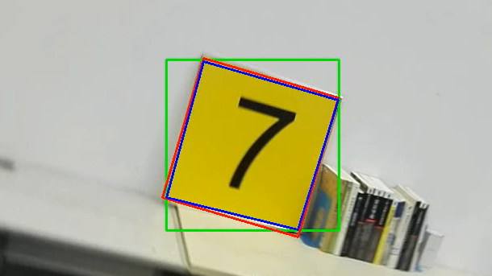
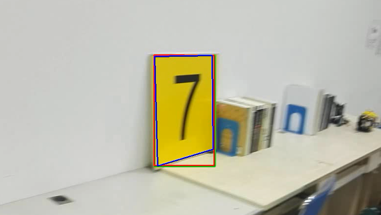

# 程序笔记
<!-- TOC -->

- [程序笔记](#程序笔记)
    - [square_detection](#square_detection)
    - [plot_waveform&spectrogram（python绘制.wav文件的波形图和语谱图）](#plot_waveformspectrogrampython绘制wav文件的波形图和语谱图)
            - [关于wav文件](#关于wav文件)
    - [background_subtraction（背景减除）](#background_subtraction背景减除)
            - [KNN](#knn)
    - [About python](#about-python)
            - [if \_\_name\_\_=='\_\_main\_\_'](#if-\_\_name\_\_\_\_main\_\_)
            - [文件路径问题](#文件路径问题)
    - [About OpenCV](#about-opencv)
            - [OpenCV与Matplotib](#opencv与matplotib)
            - [开启摄像头（打开视频）后没有图像](#开启摄像头打开视频后没有图像)

<!-- /TOC -->
## square_detection

*任务要求：给定两个视频，视频中有一个黄色的矩形面板，要求将其框出来，并输出结果*

整体思路就是使用HSV模型利用颜色的不同将目标物体的与周围环境区分开（适用于目标颜色与周围环境颜色差距较大时），然后再将其二值化后将目标物体框出。

主要的过程方法在程序[square_detection.py](https://github.com/XinzheTing/Courses/blob/master/DigitalImageProcessing/square_detection/square_detection.py)中注释已经写的很清楚了，这里主要说一下在框出目标物体时所使用的三种方法（这三种方法在处理data1.avi时效果相同，主要区别是在处理data2.avi时，因为data2.avi考虑了目标物体的旋转和倾斜）：

1. 固定矩形（我暂且这么称呼它）

    在这种方法中，我使用了boundingRect函数，它的作用是计算轮廓的垂直边界最小矩形，**矩形是与图像上下边界平行的**。这个函数返回来矩形左上角顶点坐标和举行的长和宽，依据这些信息我们就可以画出一个矩形。但是这种方法没有考虑旋转，在目标与图像上下边界平行时没有问题，但是当目标发生了旋转，这时框出的矩形包含了很多除目标物体以外的区域，如下图绿色矩形

    <div align=center>

    

    </div>

2. 外接矩形
  
   这种方法使用minAreaRect函数，它是计算轮廓的外接矩形，弥补了固定矩形方法中在目标物体发生旋转时的不足。见上图红色矩形。

3. 近似轮廓

   以上两种方法在目标物体发生倾斜时，仍有一些不足。进一步学习了解到，findContours所找到的轮廓直接输出的话最贴近目标物体的形状，不论物体如何变化（远近，旋转，倾斜）都可以很好的描绘出，但是findContours所找到的轮廓是一些列散列的点。使用轮廓近似函数approxPolyDP可以选择其中的部分点在使用polylines将这些点连起来，通过改变取点的间隔就可以控制轮廓近似的程度。结果见下图蓝色矩形。

   <div align=center>

   

   <div>

> 参考文章：
> [python opencv检测目标颜色](https://blog.csdn.net/Lingdongtianxia/article/details/75194950)
> 
> [Python图像处理（7）：利用轮廓分块处理](https://blog.csdn.net/lights_joy/article/details/46368197)
> 
> [[opencv]Opencv（Python） 教程-轮廓（2）轮廓特征求取](https://blog.csdn.net/zj360202/article/details/79170265)
> 
> [OpenCV-Python 中文教程15——OpenCV 中的轮廓](https://blog.csdn.net/zichen_ziqi/article/details/80912133)

## plot_waveform&spectrogram（python绘制.wav文件的波形图和语谱图）

#### 关于wav文件

1. wav文件存储的音频格式未经过压缩，所以在音质方面不会出现失真问题，但同时其文件体积通常比较大.
2. Resource Interchange File Format（简称 RIFF），资源交换文件格式，是一种按照标记区块存储数据（tagged chunks）的通用文件存储格式，多用于存储音频、视频等多媒体数据. Microsoft 在 windows 下的 AVI、ANI 、WAV 等都是基于 RIFF 实现的.chunk 是 RIFF 组成的基本单位，每个 CHUNK 可看作存贮了视频的一帧数据或者是音频的一帧数据。
3. chunk总共由三部分组成FOURCC（使用4字节的ASIIC字符标识类型）


> 参考文章
> 
> [语音信号处理之时域分析-音色及其Python实现](http://ibillxia.github.io/blog/2013/05/18/audio-signal-processing-time-domain-timbre-python-realization/)
> 
> [Python 解析 Wav 文件并绘制波形的方法](https://www.cnblogs.com/lzxwalex/p/6922099.html)

## background_subtraction（背景减除）

#### KNN

## About python

#### if \_\_name\_\_=='\_\_main\_\_'

这个是用来区分当前源文件是作为主程序运行还是作为模块被导入其他文件
由于每个python模块（python文件）都包含内置的变量\_\_name\_\_，当运行模块被执行的时候，\_\_name\_\_等于文件名（包含了后缀 .py）。如果import到其他模块中，则\_\_name\_\_等于模块名称（不包含后缀 .py）。而“\_\_main\_\_”等于当前执行文件的名称（包含了后缀 .py）。所以当模块被直接执行时，\_\_name\_\_ == '\_\_main\_\_'结果为真；而当模块被import到其他模块中时，\_\_name\_\_ == '\_\_main\_\_'结果为假，就是不调用对应的方法。

#### 文件路径问题

在使用VS Code编程中发现，当打开的文件夹包含多个子文件夹，而运行的python程序恰好在某一子文件夹内，那么在打开文件时就不能直接输入文件名（即使程序与要打开的文件在同一文件夹下），不知道为什么不能默认先搜索一下程序所在的文件夹。

**解决办法：** 将要打开的文件与程序放到同一文件夹下，然后使用下面两行代码来获取文件的绝对路径。
```python
module_path = os.path.dirname(__file__)
filein = module_path+'/文件名.扩展名'
```


## About OpenCV

#### OpenCV与Matplotib

彩色图像使用OpenCV加载时是BGR模式。但是Matplotib是RGB模式。所以彩色图像如果已经被OpenCV读取，那它将不会被Matplotib正确显示。
在python中有一种很简单的转换方式 ```img1 = img[:,:,::-1]```

#### 开启摄像头（打开视频）后没有图像

在做背景减除时发现，运行程序摄像头开启了去不显示图像（我的笔记本电脑在摄像头开启时，摄像头旁边的一个小灯会亮），开以为是电脑问题或是权限不够，然后在网上各种找相关的问题。后来发现是因为程序中缺少一句话：
```python
if cv2.waitKey(1) & 0xFF == ord('q'):
        break
```
那么这句话是什么意思呢？这句话的有一个函数``` cv2.waitKey ```主要作用是等待1ms的键盘输入然后返回输入符号的ASCII码，如果没有输入则返回-1。后面的``` &0xFF ```是取返回值的低八位，主要是针对64位操作系统有时返回值不止8位，等号后面的``` ord('q') ```是计算q键的ASCII码，所以这句话是说“按q键退出”。不要小瞧了这简单的一段程序，就是因为少了这一句，while循环在飞速的执行，导致窗口没有画面显示，而有了这段程序while循环在执行时就会有1ms的暂停，就是这1ms使得图像得以正常显示。无论是从摄像头中读取画面还是从视频中读取，都需要这样一个停顿来时图像正常显示，但是停顿时间不太一样，摄像头由于需要实时性，所以1ms就好（``` cv2.waitKey ```中传参数0则为无限等待直到键盘有输入），但是对于视频，需要其以正常速度播放的话一般设置在25~30ms（不同的等待时间就相当于改变视频的播放速度）